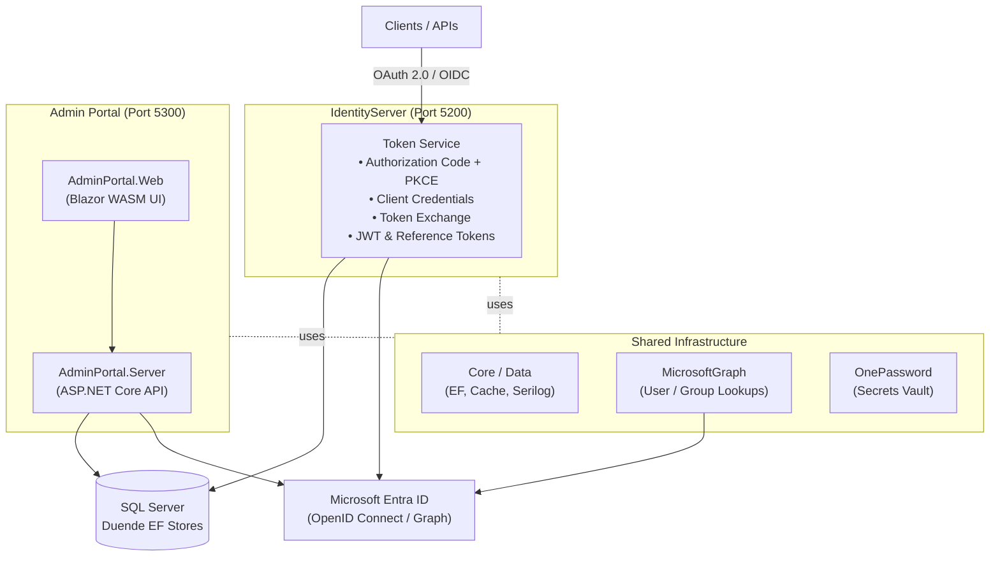

# Identity Server

A centralized, enterprise-grade **Identity and Access Management (IAM)** solution built on [Duende IdentityServer](https://duendesoftware.com/products/identityserver). It implements **OAuth 2.0** and **OpenID Connect (OIDC)** protocols and ships with a Blazor-based admin portal for configuration management.

## Table of Contents

- [Overview](#overview)
- [Architecture](#architecture)
- [Features](#features)
- [Prerequisites](#prerequisites)
- [Getting Started](#getting-started)
- [Building the Solution](#building-the-solution)
- [Running the Applications](#running-the-applications)
- [Key Endpoints](#key-endpoints)
- [Testing](#testing)
- [Database Setup](#database-setup)
- [Project Structure](#project-structure)
- [Configuration Reference](#configuration-reference)
- [Logging](#logging)
- [Troubleshooting](#troubleshooting)
- [Contributing](#contributing)
- [License](#license)

---

## Overview

Identity Server provides a secure token service for applications across the organisation. It supports multiple OAuth 2.0 flows, integrates with **Microsoft Entra ID** (formerly Azure AD) for user authentication, and stores all configuration and operational data in **SQL Server**. Secrets are managed via **Azure Key Vault** and **1Password**.

---

## Architecture



---

## Features

### OAuth 2.0 / OpenID Connect
- Authorization Code flow with PKCE
- Client Credentials flow (machine-to-machine)
- Token Exchange (custom grant)
- JWT and reference token support
- Token introspection endpoint

> **Token Exchange (custom grant).** In addition to the standard flows, the server implements a custom token-exchange grant (`urn:ietf:params:oauth:grant-type:token-exchange`) so that one valid token can be exchanged for another. It is wired up through `CustomTokenExchangeGrantValidator` (validates the incoming token and resolves the subject), `CustomProfileService` (populates claims for the issued token), and `CustomTokenResponseGenerator` (shapes the token response). A client must have the token-exchange grant type enabled in its configuration to use it.

### Authentication
- Microsoft Entra ID (OpenID Connect, v1.0 & v2.0)
- External login support
- JWT Bearer authentication for API consumers
- Configurable cookie lifetime

### Client & API Management
- Create and configure OAuth 2.0 clients
- Manage API resources, scopes, and claims
- Client secret rotation and CORS origin management
- Custom redirect URI validation
- Role-based access control (RBAC)

### Admin Portal
- Blazor WebAssembly UI for all configuration tasks
- User and group management (Entra ID linked)
- System permissions and role assignments
- Audit history and change tracking
- Import/export functionality

### Infrastructure
- Distributed caching with Redis / Valkey or in-memory
- Azure Key Vault for data-protection keys and the Duende licence key
- 1Password vault integration for runtime secret injection
- Serilog structured logging with a centralised log sink
- Health check endpoints
- Swagger / OpenAPI documentation (non-production environments)
- Windows Service hosting with WiX installer

---

## Prerequisites

| Requirement | Version |
|---|---|
| [.NET SDK](https://dotnet.microsoft.com/download) | 8.0 |
| [SQL Server](https://www.microsoft.com/en-gb/sql-server) | 2019+ |
| Azure subscription | Key Vault access required |
| 1Password account | Vault access for Entra credentials |
| Redis / Valkey *(optional)* | For distributed caching |

---

## Getting Started

### 1. Clone the repository

```bash
git clone https://github.com/sefe/identity-server.git
cd identity-server
```

### 2. Configure local settings

Each application reads configuration from the following sources (highest priority last):

1. `appsettings.json` – base settings
2. `appsettings.local.json` – local overrides (committed as examples; must not contain secrets)
3. Environment variables
4. .NET User Secrets (development)
5. 1Password Vault – Entra ID credentials injected at startup
6. Azure Key Vault – data-protection keys and Duende licence

Update `appsettings.local.json` in both locations (these files are already committed as examples):
- `src/IdentityServer/IdentityServer/`
- `src/IdentityServer.UI.Admin/IdentityServer.AdminPortal.Server/`

Minimum required settings:

```json
{
  "ConnectionStrings": {
    "IDPDBConnectionString": "Server=localhost;Database=IdentityServer;Trusted_Connection=True;"
  }
}
```

> **SQL Authentication:** If Windows Authentication is not available (e.g. in containers or cross-platform environments), use SQL credentials instead:
> ```
> Server=localhost;Database=IdentityServer;User Id=<user>;Password=<password>;
> ```
> Store credentials in [.NET User Secrets](https://learn.microsoft.com/en-us/aspnet/core/security/app-secrets) or environment variables — never commit them to `appsettings.json`.

```json
{
  "MicrosoftEntra": {
    "ClientId": "<your-entra-app-client-id>",
    "TenantId": "<your-entra-tenant-id>",
    "ClientSecret": "<your-entra-client-secret>"
  },
  "AzureKeyVault": {
    "Uri": "https://<your-keyvault>.vault.azure.net/"
  }
}
```

### 3. Set up the database

See [Database Setup](#database-setup) below.

---

## Building the Solution

```bash
# Identity Server
dotnet build src/IdentityServer/IdentityServer.sln

# Admin Portal
dotnet build src/IdentityServer.UI.Admin/IdentityServer.AdminPortal.sln
```

---

## Running the Applications

```bash
# Identity Server – https://localhost:5200
dotnet run --project src/IdentityServer/IdentityServer/IdentityServer.csproj

# Admin Portal – https://localhost:5300
dotnet run --project src/IdentityServer.UI.Admin/IdentityServer.AdminPortal.Server/IdentityServer.AdminPortal.Server.csproj
```

Swagger UI is available at `https://localhost:5200/swagger` in non-production environments.

---

## Key Endpoints

With the applications running locally on their default ports:

### IdentityServer (`https://localhost:5200`)

| Endpoint | Purpose |
|---|---|
| `/.well-known/openid-configuration` | OpenID Connect discovery document |
| `/connect/authorize` | Authorization endpoint (Authorization Code + PKCE) |
| `/connect/token` | Token endpoint (all grant types, including token exchange) |
| `/connect/introspect` | Token introspection |
| `/swagger` | Swagger / OpenAPI UI (non-production only) |

### Admin Portal (`https://localhost:5300`)

| Endpoint | Purpose |
|---|---|
| `/` | Blazor WebAssembly admin UI |
| `/health` | Health check (returns service status) |
| `/swagger` | Admin API Swagger / OpenAPI UI (non-production only) |

> **Note:** The OpenID Connect / OAuth endpoints (`/connect/*`, `/.well-known/*`) are served by IdentityServer. The Admin Portal is the management UI and its companion API.

---

## Testing

The solution contains 8 test projects (plus a shared `IdentityServer.Tests.Common` helper library) using **NUnit**, **NSubstitute**, and **AutoFixture**.

```bash
# Run all Identity Server tests
dotnet test src/IdentityServer/IdentityServer.sln

# Run all Admin Portal tests
dotnet test src/IdentityServer.UI.Admin/IdentityServer.AdminPortal.sln

# Run a specific test project
dotnet test src/IdentityServer.Common/IdentityServer.Data.Test/IdentityServer.Data.Test.csproj
```

---

## Database Setup

The database schema is managed as a **SQL Server DACPAC** project (`src/IdentityServer.Database/`).

### Deploy the DACPAC

Publish using Visual Studio SQL Server Data Tools or the `sqlpackage` CLI:

```bash
sqlpackage /Action:Publish \
  /SourceFile:"IdentityServer.Database.dacpac" \
  /TargetConnectionString:"<connection-string>"
```

### Post-deployment scripts

Post-deployment scripts run in the following order:

| Folder | Purpose |
|---|---|
| `Post/BeforeEnvironmentSpecific/` | Runs first; environment-agnostic seed data |
| `Post/EnvironmentSpecific/{env}/` | Environment-specific data (`DV`, `QA`, `PP`, `PROD`) |
| `Post/AfterEnvironmentSpecific/` | Runs last; finalisation steps |

> **Note:** After adding a new script, right-click `PostDeploymentAggregation.tt` and select **Run Custom Tool** to regenerate the aggregation script. Without this step the new script will not be included in the DACPAC.

---

## Project Structure

```
identity-server/
├── src/
│   ├── IdentityServer/                    # OAuth 2.0 / OIDC server solution (IdentityServer.sln)
│   │   ├── IdentityServer/                # Main API – token generation & validation
│   │   ├── IdentityServer.Setup/          # WiX installer project
│   │   └── IdentityServer.Test/           # Integration & unit tests
│   │
│   ├── IdentityServer.Common/             # Shared libraries (projects referenced by the solutions above)
│   │   ├── IdentityServer.Abstraction/    # Interfaces, contracts, constants, enums
│   │   ├── IdentityServer.Core/           # Caching, config, DI, HTTP resilience
│   │   ├── IdentityServer.Core.Serilog/   # Serilog configuration & custom sinks
│   │   ├── IdentityServer.Data/           # EF Core DbContext, repositories, migrations
│   │   ├── IdentityServer.MicrosoftGraph/ # Microsoft Graph / Entra ID integration
│   │   ├── IdentityServer.OnePassword/    # 1Password secrets management
│   │   └── *Tests/                        # Unit tests for each library
│   │
│   ├── IdentityServer.Database/           # SQL Server DACPAC project
│   │   ├── dbo/                           # Tables, views, stored procedures
│   │   ├── Security/                      # Roles and permissions
│   │   └── Post/                          # Post-deployment scripts
│   │
│   └── IdentityServer.UI.Admin/           # Admin portal solution (IdentityServer.AdminPortal.sln)
│       ├── IdentityServer.AdminPortal.Server/  # ASP.NET Core backend API
│       ├── IdentityServer.AdminPortal.Web/     # Blazor WASM frontend
│       ├── IdentityServer.AdminPortal.Setup/   # WiX installer project
│       └── IdentityServer.AdminPortal.Test/    # Tests
│
├── CONTRIBUTING.md
├── LICENSE.md
└── README.md
```

---

## Configuration Reference

### System

| Key | Description | Example |
|---|---|---|
| `System:SystemName` | Application name for logging | `IdentityServer` |
| `System:EnvironmentTier` | Deployment tier | `DV`, `QA`, `PP`, `PROD` |
| `System:LoadBalancer:IpRange` | Load balancer IP for forwarded-header trust | `10.0.0.0` |

### Caching

| Key | Description |
|---|---|
| `IdentityServer:CachingOptions:Enabled` | Enable/disable distributed caching |
| `IdentityServer:CachingOptions:Provider:Kind` | Cache provider: `InMemory` or `Valkey` |
| `IdentityServer:CachingOptions:Provider:ConnectionString` | Valkey connection string (Valkey only) |
| `IdentityServer:CachingOptions:Provider:Username` | Valkey username (Valkey only) |
| `IdentityServer:CachingOptions:Provider:Password` | Valkey password (Valkey only) |

### Feature Flags

| Key | Description |
|---|---|
| `FeatureFlags:UseCustomRedirectUriValidator` | Enable loopback redirect URI validation (development) |
| `FeatureFlags:CustomTokenLoggingSettings:EnableCustomTokenLogging` | Enable detailed token event logging |

---

## Logging

Logging is configured with **Serilog** via the `Serilog` section in `appsettings.json`. Out of the box, each application writes to multiple sinks:

| Sink | Destination | Notes |
|---|---|---|
| `TradingStandardSink` | Centralised log server (e.g. Logstash over HTTPS) | Custom sink from `IdentityServer.Core.Serilog`; configured under `Serilog:WriteTo`. Set `requestUri`/credentials per environment. |
| `Async` → `File` | Rolling file on disk (default `c:\log\…`) | Size-limited, rolling files with a retained-file count. Adjust `path` for non-Windows hosts. |
| `Console` | Standard output | Useful for local development and containers. |

Diagnostics for Serilog itself are controlled by the `System` section:

| Key | Description |
|---|---|
| `System:EnableLoggingDiagnosticsToConsole` | Write Serilog self-diagnostics to the console |
| `System:EnableLoggingDiagnosticsToFile` | Write Serilog self-diagnostics to `System:LoggingDiagnosticsFile` |

> **Local development:** The default file paths point at `c:\log\`. On non-Windows machines (or to avoid writing to disk), override the `Serilog:WriteTo` paths in `appsettings.local.json`, or rely on the console sink.

---

## Troubleshooting

### IdentityServer fails to start / HTTPS binding error on port 5200

`appsettings.json` configures Kestrel to load its TLS certificate from the **Windows certificate store** (`LocalMachine\My`):

```json
"Kestrel": {
  "Endpoints": {
    "IDPHttpsEndpoint": {
      "Url": "https://*:5200",
      "Certificate": { "Subject": "", "Store": "My", "Location": "LocalMachine", "AllowInvalid": false }
    }
  }
}
```

If no matching certificate is installed, the host will fail to bind. For local development you have two options:

1. **Use the ASP.NET Core developer certificate** and override the Kestrel endpoint in `appsettings.local.json` so Kestrel uses the default dev cert instead of the store lookup:
   ```bash
   dotnet dev-certs https --trust
   ```
   ```json
   {
     "Kestrel": {
       "Endpoints": {
         "IDPHttpsEndpoint": { "Url": "https://localhost:5200" }
       }
     }
   }
   ```
2. **Install a certificate** into `LocalMachine\My` and set the `Subject` (and `AllowInvalid` if self-signed) accordingly.

### `IDPDBConnectionString` connection failures

Confirm the database has been deployed (see [Database Setup](#database-setup)) and that the connection string matches your environment. In containers or cross-platform setups where Windows Authentication is unavailable, switch to SQL authentication as described in [Getting Started](#getting-started).

### Logs are not being written

Check that the configured Serilog file paths exist and are writable (the defaults under `c:\log\` are Windows-specific) — see [Logging](#logging).

---

## Contributing

Contributions are welcome. Please read [CONTRIBUTING.md](CONTRIBUTING.md) for the full guidelines.

In short:

1. Fork the repository and create your branch from `main`.
2. Add tests for any new functionality.
3. Update documentation if APIs change.
4. Ensure `dotnet test` passes.
5. Open a pull request.

---

## License

This project is licensed under the **Apache License 2.0**. See [LICENSE.md](LICENSE.md) for details.